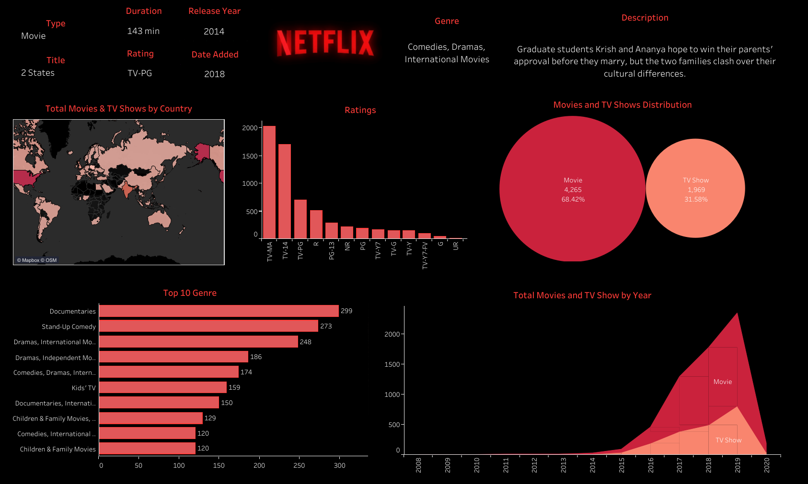

# 🎬 Tableau Project: Netflix Dashboard

This interactive Tableau dashboard provides a deep dive into Netflix’s global content library, exploring distribution by genre, country, ratings and release year. It highlights trends in how Netflix has expanded over time and gives insights into the types of content most available on the platform.  

🔗 [View the interactive dashboard on Tableau Public](https://public.tableau.com/app/profile/ayomikun.ojueromi3921/viz/NetflixDashboard_17587177735680/Dashboard1#1)

---

## 📊 Dashboard Summary

Built using Tableau, this dashboard includes several interactive views:

- **Overview**: Snapshot of Netflix’s content library.  
- **Genre Breakdown**: Comparison of TV shows and movies across genres.  
- **Release Trends**: Content released across years and growth patterns.  
- **Country Distribution**: Visualises where Netflix content originates from.

## 🛠️ Tools Used

- **Tableau Public** (Interactive dashboard & visualisation)  
- **CSV Dataset** (Netflix titles data)  
- **Excel** (Data cleaning and preprocessing)  

---

## 🖼️ Dashboard Preview

---

## 📁 Files in this Repo

| File | Description |
|------|-------------|
| `Netflix-Dashboard.png` | Screenshot of the Tableau Netflix Dashboard |
| `netflix_titles.csv` | Netflix csv dataset |
| `README.md` | Project Summary (you’re reading it!) |

---

## 🤝 Let’s Connect

📍 [LinkedIn](https://www.linkedin.com/in/aojueromi)
